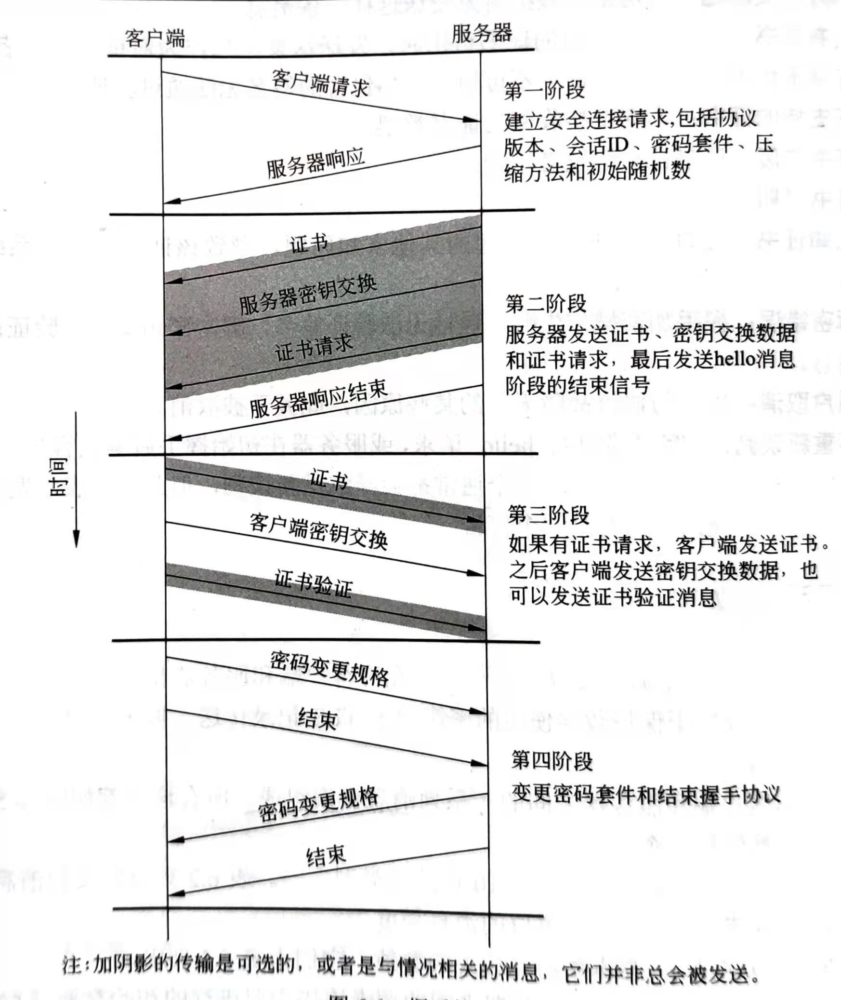
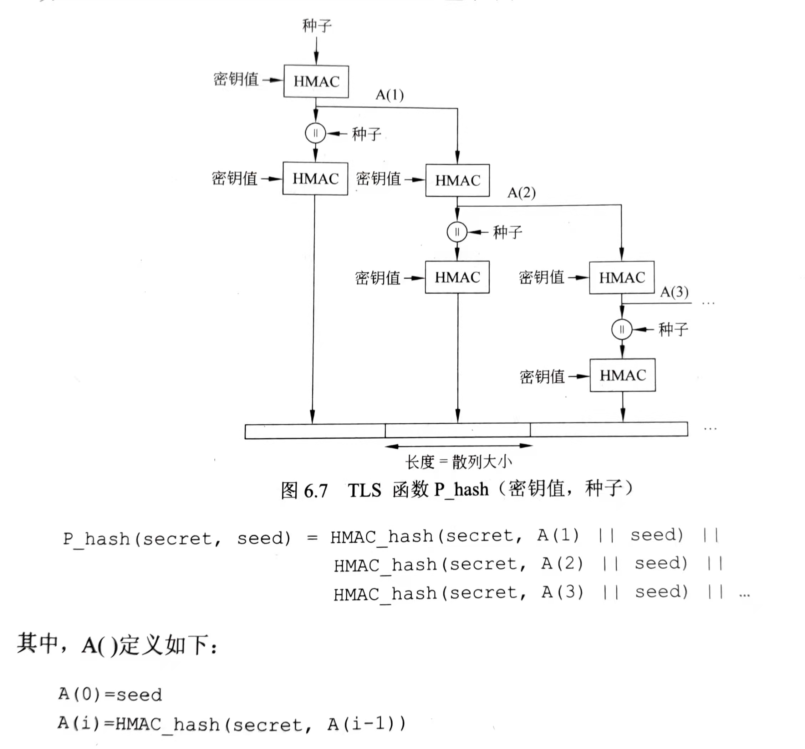
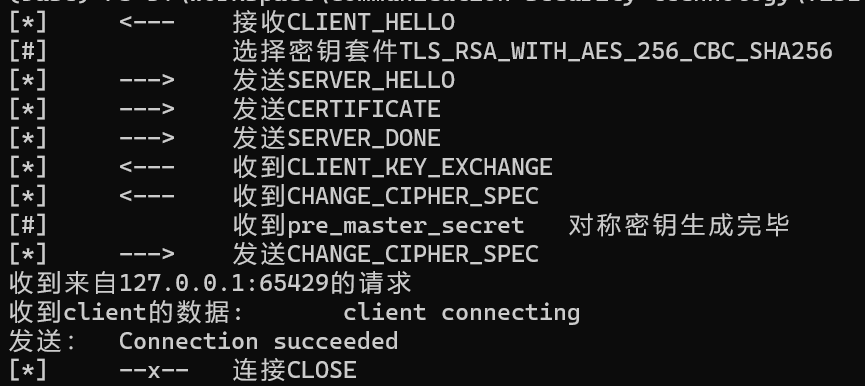
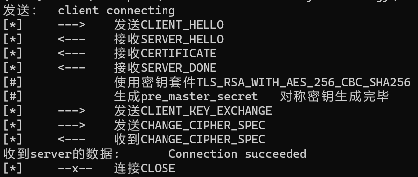

# 模拟TLS设计文档

## 1.基本信息

使用的语言： Python3.8.8 64-bit

开发平台：win10


### 1.1 使用的库及用途

| 包名                      | 版本   | 用途       |
| ------------------------- | ------ | ---------- |
| numpy | 1.20.1 | 生成随机数 |
| pycryptodome (win平台下的pycrypto) | 3.11.0 | AES加密    |
| rsa  | 4.7.2  | RSA加密    |


### 1.2 模拟实现思路

主要是现简要的TLS过程，实现的细节我参考了**RFC 8446**，`TLSContentType`、`TLSMessageType`的值都**RFC 8446**中一致，尽量去贴合最真实的TLS传输过程，但是在很多地方也有所妥协。

Python标准库对`TLS`协议的实现，是对`OpenSSL`库进行封装，但这样一来就很难利用TLS协议进行==隐蔽通信==，与其去研究`OpenSSL`如何配置，不如自己模拟一个`TLS`协议，在模拟的`TLS`协议上进行隐蔽通信。

在模拟设计时，`mySSL`实现的接口，尽量贴合了Python标准，同时由于只是简单模拟，本次实验并没有实现所有的`TLS`密钥套件，`mySSL`中仅实现了`TLS_RSA_WITH_AES_256_CBC_SHA256`一种密钥套件。


### 1.3 报文传输形式

由于Python提供了极为方便的列表类型，而Python对byte的处理相对较为复杂，所以报文的形式并不是使用ASCII编码的byte流，而是使用链表装换为`json`对象进行发送的方式，对于部分`json`对象无法处理的byte，使用`base64`进行转码，下面是一个例子：

```python
# client hello内容
CLIENT_HELLO 	= [TLSVersion.TLSv1_2, base64.b64encode(self.clientRandom).decode(),
               		0, [i.value for i in TLSCipherSuites], None]
# client请求内容
clientRequest 	= [TLSMessageType.CLIENT_HELLO,
                 	len(CLIENT_HELLO), CLIENT_HELLO]
# TLS最终传输报文
TLSContent 		= [HANDSHAKE, clientRequest]
# 最终发送
socket.send(json.dumps(TLSContent).encode())
```

尽管这样与TLS实际实现不同，但实现和于都起来较为容易。


### 1.4 模拟TLS妥协的地方

没有实现证书的认证

服务器RSA的公钥不是用过证书的方式来发送，而是直接通过服务器响应`server_hello_response`中的`CERTIFICATE`部分直接发送公钥。


## 2 连接流程

### 2.1 概要

连接流程与实验细则上提供的一致，共两次`RTT`



### 2.2 第一次发送接收

这一部分对应上图TLS协议中第一阶段：客户端请求。

#### 2.2.1 client hello

`client_hello`主要是客户端生成随机密钥也就是随机数`clientRandom`，存储后连同会话ID`sessionID`、密码套件`CipherSuites`、压缩算法一同打包，将`TLSContentType`设置为`HANDSHAKE`、`TLSMessageType`设置为`CLIENT_HELLO`，发送给服务器。

注：为了进一步**模拟**TLS协议过程，尽管只支持一种套件，`client`在`hello`的使用还是发送了` [i.value for i in TLSCipherSuites]`即将**一系列**密码套件发送过去，供`server`进行查找。

```python
'''伪代码'''
def client_hello(self):
    # 生成28字节的随机数
    self.clientRandom = random.bytes(28)
    
    #生成TLS CLIENT_HELLO 报文 
    TLSContent = [HANDSHAKE, clientRequest]

    # 发送CLIENT_HELLO
    self.socket.send(TLSContent)
```


#### 2.2.2 server hello rcev

`server_hello_rcev`就是对应去接收客户端发送的`client_hello`。收到了`client`的回复后，`server`先检查`TLSContentType`和`TLSMessageType`是否正确，正确后接收客户端发送的随机数`clientRandom`，接收会话ID`sessionID`，检查并且选择密码套件`CipherSuites`、压缩算法。

接收期间如果有一项不满足就抛出异常。

```python
'''伪代码'''
def server_hello_rcev(self):
    # 接收client的消息
    data = socket.recv(1024)

    # 先检查TLSContentType和TLSMessageType是否正确
    check(data)

    # 接收信息
    self.clientRandom = data.clientRandom
    self.sessionID = data.sessionID
    self.cipherSuites = TLS_RSA_WITH_AES_256_CBC_SHA256
```


### 2.3 第二次发送接收

这一部分对应图片第一阶段服务端响应到第二阶段结束，这部分完成了随机数`serverRandom`和`clientRandom`的交换，完成了协议的商定。

#### 2.3.1 server hello response

`server_hello_response`主要是服务端生成随机密钥也就是随机数`serverRandom`，发送选择好的密码套件`CipherSuites`、压缩算法将`TLSContentType`设置为`HANDSHAKE`、`TLSMessageType`设置为`SERVER_HELLO`，发送给服务器。

根据TLS规范，`server`这一次发送不单要发送`SERVER_HELLO`，还要`server`的公钥、hello结束标志。

发送`server`的公钥，这里设置的消息类型`TLSMessageType`为`CERTIFICATE`，主要是考虑到真实情况下，RSA公钥是通过证书在`CERTIFICATE`内发送的。

```python
 '''伪代码'''
def server_hello_response(self):
    # 生成服务端随机数
    self.serverRandom = random.bytes(28)

    # 生成RSA密钥对 并且在CERTIFICATE部分发送
    (pubkey, privkey) = rsa.newkeys(1024)

    # 生成SERVER_HELLO报文
    TLSContent = [HANDSHAKE, serverResponse]
    # 生成CERTIFICATE报文
    TLSContent1 = [HANDSHAKE, certificate]
    # 生成SERVER_DONE报文
    TLSContent2 = [HANDSHAKE, helloDone]

    socket.send([TLSContent, TLSContent1, TLSContent2])
```


#### 2.3.2 client hello rcev

`client_hello_rcev`就是对应去接收服务端发送的`server_hello_response`。收到了`server`的回复后，`client`先检查`TLSContentType`和`TLSMessageType`是否正确，正确后接收客户端发送的随机数`serverRandom`，设置服务端选择的密码套件`CipherSuites`和压缩算法。另外还要接收`server`的RSA公钥`pubkey`。

接收期间如果有一项不满足就抛出异常。

```python
  '''伪代码'''
def client_hello_rcev(self):
    # 接收server的消息
    data = socket.recv(1024)

    # 判断收到的3个包是否是符合格式
	check(data)

    # 获取server随机数
    self.serverRandom = data.serverRandom

    # 获取server的RSA公钥
    self.pubkey = data.pubkey

    # 将密码套件设置为服务器选择的密码套件
    self.cipherSuites = data.cipherSuites
```


### 2.4 第三次发送接收

这一部分对应图片第三阶段开始到第四阶段客户端发送完毕结束，这部分主要完成的密钥的生成，以及会话密钥的生成。

#### 2.4.1 keySend

主要是`client`生预备主密钥`pre_master_secret`，用`server`的公钥`pubkey`加密后发送给`server`，消息类型`TLSMessageType`标注为`CLIENT_KEY_EXCHANGE`。

一同发送的还有`CHANGE_CIPHER_SPEC`报文，不过到这里要更改会话类型`TLSContentType`改为`CHANGE_CIPHER_SPEC`。


#### 2.4.2 recvKey

主要就是服务端`server`接收`client`生预备主密钥`pre_master_secret`。


有关会话密钥的生成见第三部分 *3 会话密钥的产生*


### 2.5 第四次发送接收

最后的一次发送接收对应的是`server_finish`和`client_finish`这两个函数，也对应图片第四阶段客户端发送完毕结束开始到最后，主要是`server `发送的还有`CHANGE_CIPHER_SPEC`报文，`client`进行验证，然后双方都完成TLS握手的全流程，之后的通话全部通过加密的方式进行。


### 2.6 最终握手代码

最后形成了客户端和服务端一一对应的代码结构：

#### 2.6.1 客户端

```python 
def client_do_handshake(self):
    # 客户端向服务器hello
    self.client_hello()

    # 接收server的回复
    self.client_hello_rcev()

    # 向server发送预备主密钥
    self.keySend()

    # 接收回复看服务器是否更换密钥
    self.client_finish()

    # 连接成功
    self.is_connect = True
```


#### 2.6.2 服务端

```python
def server_do_handshake(self):
    # 服务器进行握手必须先接受一个连接
    connectionSocket, addr = self.socket.accept()

    # 连接成功后 服务端就把socket换为 连接上的client的套接字
    self.socket = connectionSocket

    # 服务器接收 client 的hello
    self.server_hello_rcev()

    # 服务响应给client
    self.server_hello_response()

    # 接收客户端的发送的钥匙
    self.recvKey()

    # 发送CHANGE_CIPHER_SPEC接收握手过程
    self.server_finish()

    # 连接成功
    self.is_connect = True

    # 返回包装好的套接字
    return (self, addr)
```


## 3 会话密钥的产生

由于使用的是`TLS_RSA_WITH_AES_256_CBC_SHA256`这种密钥套件，预备主密钥`pre_master_secret`的交换方式是RSA非对称密钥交换

### 3.1 预备主密钥交换

预备主密钥`pre_master_secret`由客户端在`keySend`函数中生成，是一个48位的随机数：

```python
 # 生成预备主密钥
self.pre_master_secret = numpy.random.bytes(48)
 # 用公钥加密预备主密钥
crypto = rsa.encrypt(self.pre_master_secret, self.pubkey)
```


### 3.2 对称密钥生成

对称密钥生成使用一个称为 `PRF` 的伪随机函数来扩展密钥以得到密钥产生和验证中的各种密钥块。采用伪随机函数的目的是使用相对较小的共享密钥值，生成较长的数据块，防止对散列函数和 MAC 的攻击。`PRF` 基于下面的数据扩展函数



 伪随机函数`PRF` 是单独作为一个类编写在`PRF.py`中，使用了Python标准库中的`hmac`库，使用`sha256`散列函数，密钥生成的格式如下：

```python 
 # secret：	密钥(预备主密钥) 
 # label：	标签(目标密钥类型) 
 # seed：	种子(随机数)
keyGenerator = PRF.prf(secret, label, seed)
 # size为希望的字节数 
key = keyGenerator.ouput(size)
```


所以到服务端`server`得到了客户端`client`发送的预备主密钥`pre_master_secret`，两者都可以使用`PRF`生成一样的一组对称密钥。根据TLS协议，他们生成了以下5个密钥：

```python
 	# 生成48字节的主密钥
    self.master_secret = PRF.prf(self.pre_master_secret, b"master secret", self.serverRandom+self.clientRandom).output(48)
    
    # 服务器写MAC密钥
    self.server_mac_secret = PRF.prf(self.master_secret, b"server mac secret", self.serverRandom+self.clientRandom).output(48)
    
    # 客户端写MAC密钥
    self.client_mac_secret = PRF.prf(self.master_secret, b"client mac secret", self.serverRandom+self.clientRandom).output(48)
    
    # 服务器写密钥
    self.server_write_secret = PRF.prf(self.master_secret, b"server write secret", self.serverRandom+self.clientRandom).output(32)
    
    # 客户端写密钥
    self.client_write_secret = PRF.prf(self.master_secret, b"client write secret", self.serverRandom+self.clientRandom).output(32)
```


## 4 加解密

由于使用的是`TLS_RSA_WITH_AES_256_CBC_SHA256`这种密钥套件，所以对称加密时使用的256位CBC模式的AES加密。

由于`Crypto`库中对AES加密算法对加密字节数有要求，必须为`block_size`的整数倍，所以单独编写了一个文件`AEScbc.py`，对AES加解密算法进行包装。

由于CBC模式下的AES加解密要设置偏移量`iv`，在现实实现的时候，一般在会话建立的第一阶段进行协商，为了实现简单直接在初始化的时候定义了偏移量`iv`的值。

收发数据的时候就用如下方式调用`AEScbc.py`加解密函数，主要要使用对应的密钥，比如服务端发送的时候要进行如下加密：

```pyhton
 sendData = AEScbc.encrypt(data, self.server_write_secret, self.iv)
```


### 4.1 加密

为了实现对任意大小的数据加密，加密函数中定义了一个填充函数，它会把数据填充至`block_size`的整数倍，然后填充的内容就是填充的字节数，填充的每个字节的值就是填充的字节数。如果数据刚好是`block_size`的整数倍，也要再填充一个`block_size`。

```python 
bs = AES.block_size

# 定义填充函数 数据总是会被填充
def pad(s): 
    return s + bytearray((bs - len(s) % bs)*[bs - len(s) % bs])
```


### 4,2 解密

解密就很简单直接去掉填充的值就可以，从数据的最后一个字节读取填充的大小然后去掉。

```python
# 定义去除填充函数
def unpad(s): 
    return s[0:-s[-1]]
```


## 5 MAC的验证

由于使用的是`TLS_RSA_WITH_AES_256_CBC_SHA256`这种密钥套件，所以使用的是`SHA256`这一种散列函数。

`MAC`(Message authentication code)  消息认证码，主要是保证消息完整性，TLS要传输应用消息时，先将数据分段成一些可操作的块，然后选择压缩或不压缩数据，再生成 MAC、加密。将最后的结果作为一个 TCP 分组送出。对接收到的数据，首先解密，然后做完整性验证、解压缩重组，最后把数据递送到更高层用户。

### 5.1 MAC添加

对任意要发送的一段数据，TLS协议都要求生成`MAC`，`MAC`的生成需要一个随机的`seed`，而这个`seed`就是密钥生成过程中产生的`client_mac_secret`和`server_mac_secret`。比如客户端`client`要发送`data`则数据应该，按如下方式在尾部添加`MAC`值：

```python
sendMAC = hmac.new(self.client_mac_secret, data, digestmod='sha256').digest()
data = data + sendMAC
```

### 5.2 MAC核对

接收数据的时候整个过程就正好和发送相反，先解密，再取`MAC`值，然后根据收到的值进行核对，如果计算出来的和生成的不一致，就抛出错误。

```python 
if recvMAC == MAC:
    return recvData[0:-32]
else:
    raise SSLerror("recv data MAC error")
```


## 7 实现效果

下面是提供的示例程序的运行结果，`[*]`或者`[#]`表示来自`mySSL`中的打印，用于指示握手流程。

server：



client：




